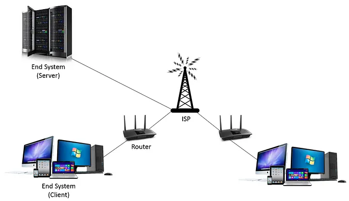
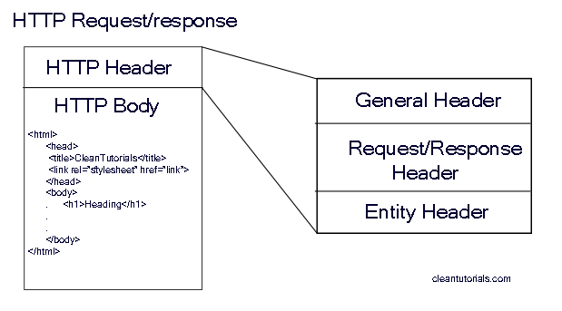
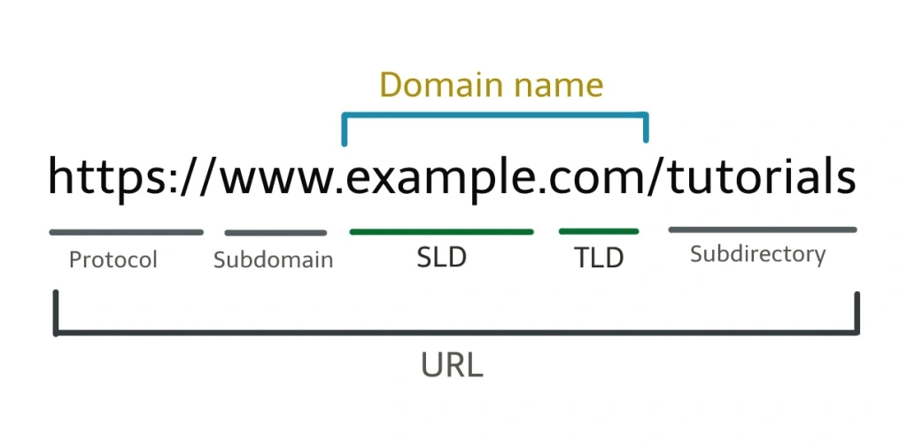

# My-Notes

## Web Development

### How does the internet Work?
The internet spans the globe through fiber optic cables. Data is transferred using light pulses that represent 0s and 1s.

To make the internet more organized and secure, there are protocols like TCP/IP, HTTP, SSL/TSL, and DNS.

There are computers called <strong>servers</strong> that store websites, databases, etc., and computers that make requests are called <strong>clients</strong>.

First, we need to understand what a packet is. A packet is like the atom of a resource on the internet. When we want to send a photo to a friend, my computer sends the photo in fragmented packets. When my friend's computer has every piece of my photo, the photo is reassembled. This way is more efficient than sending the whole photo in one go. Also, when a packet is missing, my computer is notified, so it sends the missing piece.

To establish a network, we use a computer connected to a router. The router knows where to send a packet and is connected to other routers, forming a global network connecting computers worldwide.

For determining where to send a packet, every computer connected to the internet has an address called an IP (Internet Protocol) address."

In summary, we transmit data in fragmented packets, where each packet comprises sequences of 0s and 1s conveyed as light pulses through fiber optic cables. This data is transmitted from a client to a server using various protocols, and the destination is determined by the IP address.

### What is HTTP?
HTTP (Hypertext Transfer Protocol) is a protocol that allows the exchange of information through requests and responses between clients and servers. It is stateless, meaning that each HTTP request the server receives is independent and does not relate to requests that came before it.

HTTP has four methods: GET, POST, PUT, and DELETE.

A request or response is broken down into two main components: headers and body. The header contains information about the communication between the client and the server, such as the type of content, content-length, user-agent, cookies, authentication, and more.

The body contains the actual data, such as JSON or HTML.

When we make a request or receive a response, we always get a status code. The most common ones are 200, which means everything is okay, 404 for 'not found,' and 500 indicating an internal server error.

### What is Domain Name?
The domain name of a website is the easy-to-remember address used instead of the IP, which is just a numerical representation.

## Computer Science